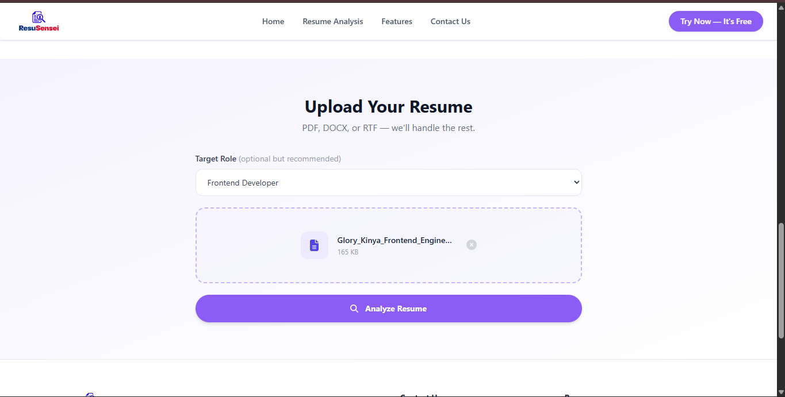
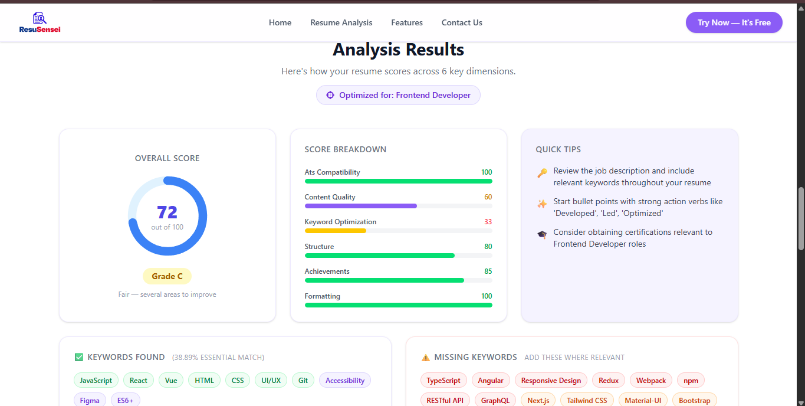

# ResuSensei 📝🤖  
**AI-Powered Resume Analyzer Web App**  

ResuSensei leverages AI to analyze resumes, providing insights, scores, and recommendations to optimize your job application success.

---

## 🚀 Features
✅ **AI-Powered Analysis** – Get an ATS-friendly score and improvement tips  
✅ **Doughnut Chart Visualization** – View your resume score at a glance  
✅ **Breakdown Section** – See detailed performance in key resume areas  
✅ **Personalized Recommendations** – AI-driven tips for better job applications  
✅ **User-Friendly Interface** – Upload and analyze resumes effortlessly  

---

## 🛠️ Tech Stack
- **Frontend**: Vue.js, Tailwind CSS  
- **Backend**: Flask, Python  
- **Libraries**: Chart.js, Axios, FontAwesome  

---

## 🎯 How to Run the Project

### **1️⃣ Clone the Repository**
```sh
git clone https://github.com/kiki-glow/ResuSensei.git
cd ResuSensei
```

### **2️⃣ Install Dependencies**
#### **Frontend (Vue.js)**
```sh
cd frontend
npm install
npm run dev
```

#### **Backend (Flask)**
```sh
cd backend
pip install -r requirements.txt
python app.py
```

---

## 📸 Screenshots
| **Resume Analysis** | **Score Breakdown** |
|---------------------|---------------------|
|  |  |

---

## 📌 To-Do List
- [ ] Implement user authentication  
- [ ] Enhance AI analysis with GPT-based feedback  
- [ ] Optimize performance for large resume files  

---

## 🤝 Contributing
1. Fork the repository  
2. Create a new branch (`feature-branch`)  
3. Commit your changes  
4. Push and create a PR  

---

## 📄 License
This project is licensed under the **MIT License**.  

💡 **ResuSensei – Helping You Land Your Dream Job!**
```

---
