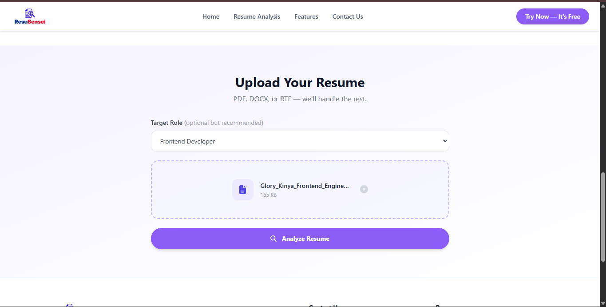
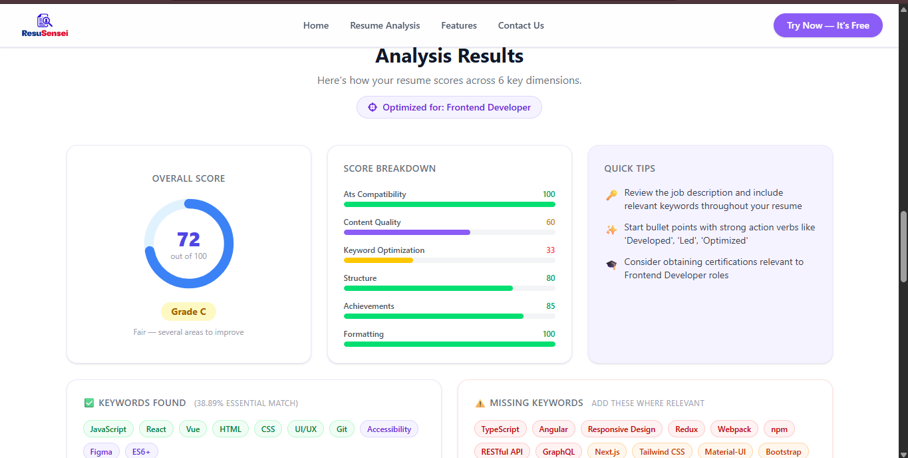

# ResuSensei 📝🤖  
**AI-Powered Resume Analyzer Web App**  

ResuSensei leverages AI to analyze resumes, providing insights, scores, and recommendations to optimize your job application success.

---

## 🚀 Features
✅ **AI-Powered Analysis** – Get an ATS-friendly score and improvement tips  
✅ **Doughnut Chart Visualization** – View your resume score at a glance  
✅ **Breakdown Section** – See detailed performance in key resume areas  
✅ **Personalized Recommendations** – AI-driven tips for better job applications  
✅ **User-Friendly Interface** – Upload and analyze resumes effortlessly  

---

## ⚙️ How It Works
1. User uploads a resume
2. Backend extracts and processes the text
3. Analysis engine evaluates:
    - Keyword relevance
    - Resume structure
    - Content quality
4. A scoring algorithm generates:
    - Overall ATS Score
    - Section-based breakdown
5. Results are returned via a REST API and displayed in the frontend

---

## 🛠️ Tech Stack
- **Frontend**: Vue.js, Tailwind CSS  
- **Backend**: Flask, Python  
- **Libraries**: Chart.js, Axios, FontAwesome  

---

## 🔌 API EndPoints
### `POST /analyze`
Analyze a resume file and return structured feedback.

**Request:**
- File upload (PDF or text)

**Response:**
```json
{
    "score": 78,
    "breakdown": {
        "keywords": 80,
        "formatting": 70
    },
    "recommendations": [
        "Add more action verbs",
        "Improve keyword matching for job descriptions"
    ]
}
```

---

## 🧠 Challenges & Solutions
- **Parsing resume content**
    - Implemented a txt extraction and preprocessing pipeline to normalize input
- **Designing a scoring system**
    - Built weighted scoring algorithm to evaluate different resume scenarios
- **Handling file uploads**
    - Added validation for file type and size to ensure stability

---

## 🎯 How to Run the Project

### **1️⃣ Clone the Repository**
```sh
git clone https://github.com/kiki-glow/ResuSensei.git
cd ResuSensei
```

### **2️⃣ Install Dependencies**
#### **Frontend (Vue.js)**
```sh
cd frontend
npm install
npm run dev
```

#### **Backend (Flask)**
```sh
cd backend
pip install -r requirements.txt
python app.py
```

---

## 📸 Screenshots
| **Resume Analysis** | **Score Breakdown** |
|---------------------|---------------------|
|  |  |

---

## 📌 Futeure Improvements
- [ ] Add user authentication and dashboards 
- [ ] Integrate advanced NLP/ML models for deeper analysis 
- [ ] Improve scalability with containerization (Docker) and cloud deployment 

---

## 🤝 Contributing
1. Fork the repository  
2. Create a new branch (`feature-branch`)  
3. Commit your changes  
4. Push and create a PR  

---

## 📄 License
This project is licensed under the **MIT License**.  

💡 **ResuSensei – Helping You Land Your Dream Job!**
```

---
